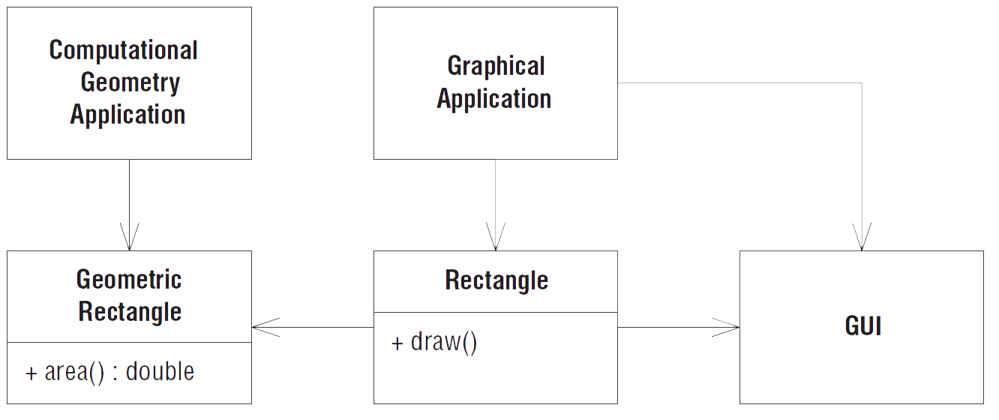

# Принцип единственной ответственности (SRP)

Оригинальный текст из книги Робертом Мартина [Agile Principles, Patterns, and Practices in C#](https://www.amazon.com/Agile-Principles-Patterns-Practices-C/dp/0131857258).

Этот принцип впервые был описан в работах [Тома ДеМарко](https://www.amazon.com/Structured-Analysis-System-Specification-DeMarco/dp/0138543801) и [Мейлира Пейдж-Джонса](https://www.amazon.com/Practical-Guide-Structured-Systems-Design/dp/0136907695/). Они назвали его *сцепленностью* (cohesion), определив ее как функциональную связанность элементов модуля. Далее мы будем понимать под сцепленностью силы, заставляющие модуль или класс изменяться. Один из группы принципов [SOLID](SOLID.md).

---
**Принцип единственной ответственности (Single-Responsibility Principle – SRP)**

У класса должна быть только одна причина для изменения.

---

Почему так важно было разделять разные обязанности между разным классами? Потому, что каждая обязанность – это ось изменения. Любое изменение требований проявляется в изменении распределения обязанностей между классами. Если класс берет на себя несколько обязанностей, то у него появляется несколько причин для изменения.

Если класс отвечает за несколько действий, то его обязанности оказываются связанными. Изменение одной обязанности может привести к тому, что класс перестанет справляться с другими. Такого рода связанность – причина хрупкого дизайна, который неожиданным образом разрушается при изменении.

Если класс отвечает за несколько действий, то его обязанности оказываются связанными. Изменение одной обязанности может привести к тому, что класс перестанет справляться с другими. Такого рода связанность – причина хрупкого дизайна, который неожиданным образом разрушается при изменении.

Рассмотрим пример. У класса ```Rectangle``` есть два метода. Один рисует прямоугольник на экране, другой вычисляет площадь прямоугольника.


*Более одной обязанности*

Классом ```Rectangle``` пользуются два разных приложения. Одно относится к области вычислительной геометрии. Класс ```Rectangle``` в нем применяется для математических вычислений с геометрическими фигурами, но на экране оно ничего не рисует. Другое приложение графическое, оно может каким-то образом касаться и вычислительной геометрии, но совершенно точно выводит прямоугольник на экран.

Такой дизайн нарушает принцип SRP. У класса ```Rectangle``` две обязанности: предоставление математической модели прямоугольника и рисование прямоугольника в графическом интерфейсе пользователя (UI).

Нарушение SRP порождает ряд серьезных проблем. Во-первых, мы должны включать UI в приложение вычислительной геометрии. В Java придется собирать относящуюся к UI часть системы и развёртывать её вместе с приложением вычислительной геометрии.

Во-вторых, если изменение приложения ```GraphicalApplication``` по какой-то причине потребует изменить класс ```Rectangle```, то нам придется заново собирать, тестировать и развертывать приложение ```ComputationalGeometryApplication```. Если мы забудем об этом, то приложение может неожиданно перестать работать.

Более правильный подход к дизайну состоит в том, чтобы распределить обязанности по двум разным классам. Теперь
вычислительная часть ```Rectangle``` помещена в класс ```GeometricRectangle``` и изменения в алгоритме рисования прямоугольников не могут повлиять на приложение ```ComputationalGeometryApplication```.


*Обязанности разделены*

## Определение обязанности

В контексте принципа SRP мы будем называть обязанностью причину изменения. Если вы можете найти несколько причин для изменения класса, то у такого класса более одной обязанности. Иногда увидеть это трудно. Мы привыкли воспринимать обязанности группами. Рассмотрим, например, интерфейс ```Modem```. Многие согласятся, что выглядит он совершенно нормально. Все четыре объявленных метода, несомненно, относятся к модему.

*Modem.java - нарушение SRP*

```java
public interface Modem {
    void dial(String pno);
    void hangup();
    void send(char c);
    char receive();
}
```

Однако здесь присутствуют две обязанности: управление соединением (методы ```dial``` и ```hangup```) и передача данных (методы ```send``` и ```receive```).

Следует ли разделить эти обязанности? Все зависит от того, как именно изменяется приложение. Если модификация подразумевает изменение сигнатуры методов управления соединением, то дизайн начинает попахивать "жесткостью", так как классы, вызывающие ```send``` и ```receive```, придётся повторно компилировать и развертывать чаще, чем хотелось бы. В таком случае обязанности следует разделить. Это защищает приложение-клиент от связанности двух обязанностей.


*Разделённый интерфейс модема*

С другой стороны, если приложение не модифицируют таким образом, что эти обязанности изменяются порознь, то и разделять их нет необходимости. Более того, разделение в этом случае попахивало бы ненужной сложностью.

Отсюда вытекает следствие. *Ось изменения становится таковой, только если изменение имеет место*. Неразумно применять SRP – как и любой другой принцип, если для того нет причин.

## Разделение связанных обязанностей

Обратите внимание, что на предыдущем рисунке обе обязанности связаны в классе ```ModemImplementation```. Это нежелательно, но может оказаться необходимым. Часто имеются причины, обычно относящиеся к деталям оборудования или операционной системы, которые вынуждают нас связывать такие вещи, которые связывать не хотелось бы. Но, разделив интерфейсы, мы развели эти концепции с точки зрения приложения.

Класс ModemImplementation можно считать вынужденным клуджем (англ. [kludge](https://ru.wiktionary.org/wiki/kludge)); однако отметим, что все зависимости ведут от него. Ничто не обязано зависеть от этого класса. Ничто, кроме метода ```main```, не обязано знать о его существовании. Таким образом, мы поместили этого "уродца" за периметр. Его яд не проникнет наружу и не отравит остальное приложение.

## Обеспечение сохранности

На рисунке ниже показано распространенное нарушение принципа SRP. Класс ```Employee``` содержит как бизнес-правила, так и механизмы управления сохранением. Эти обязанности почти никогда не следует смешивать. Бизнес-правила имеют тенденцию часто изменяться, а механизмы сохранения изменяются реже и совершенно по другим причинам. Связывать бизнес-правила с подсистемой сохранения – значит нарываться на неприятности.


*Связанный механизм сохранения*

К счастью, подход [разработки через тестирование (TDD)](TDD.md) обычно вынуждает разделять эти обязанности задолго до того, как в дизайне появляется "душок". Однако если тесты не заставили это сделать, а аромат "жесткости" и "хрупкости" ощущается всё сильнее, то дизайн следует подвергнуть [рефакторингу](Refactoring.md), применяя для разделения обязанностей паттерны Фасад, DAO (Data Access Object – Объект доступа к данным) или Заместитель (Proxy).

## Выводы

Принцип единственной ответственности – один из самых простых, но при этом его трудно применять правильно. Сочетание обязанностей для нас выглядит совершенно естественно. Их выявление и разделение как раз и является одной из задач проектирования ПО. Мы еще будем неоднократно возвращаться к этой теме при обсуждении остальных принципов.

Адаптировал: [Кротов Артём](https://fb.com/artem.v.krotov).

Остались вопросы? Задавай в [нашем чате](https://t.me/technicalexcellenceru).
